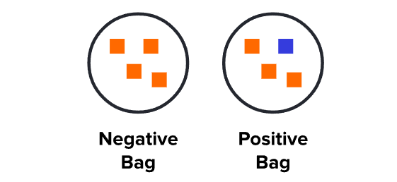

# Multiple Instance Learning

A form of weakly supervised learning.

1. Instances are grouped into bags.
2. Bags are given the labels instead of instances.
3. This solves data that is expensive to label at the instance level.

Used in:

- **Medical Imaging**. Labeling whole slide images at the pixel level is very expensive as WSI's are generally very high def. Hence weakly labelling the patches instead of the cells themselves may prove more cost efficient.
- **Video/Audio**. 
- **Text**. Document Classification.
- **Marketing**. Predicting which groups are impacted by marketing campaign.
- **Time Series**. Multivariate time series classification.

## Representation

A bag is labeled negative iff it contains only negative instances, while positive bags contain at least one positive instance.

An analogy can be made comparing MIL to a situation where several people have a specific key chain that contains keys. Some people can enter a specific room while some can't. The task is to predict which key or key chain can get you into that specific room.

Intuitively, we are finding the common key(instance) among all positive key chains(bags), and then we can correctly classify an entire keychain as positive if it has the required key.

This assumption can also be modified to accomodate problems where positive bags cannot be indentified by a single instance, but by its accumulation. A simple example is the classification of desert, sea and beach images. A beach has both water and sand segments, thus several positive instances are needed to separate the classes.

## Algorithms to Solve MIL Training Paradigmn

- Diverse Density (DD):
        Diverse Density is a framework that models bags as sets of instances and aims to capture the diversity of positive instances within positive bags. It considers not only the presence of positive instances but also their distribution within the bag. This approach is based on estimating the density of positive instances in the feature space.

- Expectation-Maximization (EM) Algorithm:
        EM-based algorithms are often used in MIL. The EM algorithm iteratively estimates the parameters of a statistical model while dealing with missing or ambiguous instance labels. The EM framework has been adapted for MIL, where the latent variables correspond to the true labels of instances.

- Instance-Level Constraints:
        This approach introduces constraints at the instance level to guide the learning process. It may involve pairwise constraints (e.g., must-link or cannot-link constraints) to specify relationships between instances. These constraints are then used during the training of a standard supervised learning algorithm.

- Multi-Instance Support Vector Machines (MI-SVM):
        MI-SVM extends traditional Support Vector Machines (SVM) to the MIL setting. It formulates the learning problem as a constrained optimization problem, where bags are treated as sets of instances. MI-SVM has been widely used for binary classification tasks in MIL.

- Multi-Instance k-Nearest Neighbors (MI-kNN):
        This algorithm is an extension of the k-Nearest Neighbors (kNN) algorithm for MIL. It classifies bags based on the labels of their nearest neighbors in the instance space. MI-kNN is simple and effective for certain types of MIL problems.

- Deep Multiple Instance Learning (Deep MIL):
        With the rise of deep learning, there have been attempts to extend neural network architectures to handle MIL problems. Deep MIL methods typically involve neural networks with specialized structures to handle bags and instances, capturing complex relationships within and between bags.

- Multi-Instance Neural Networks (MINN):
        MINN is a neural network-based approach for MIL. It leverages shared parameters across instances in a bag and has been used for tasks such as image classification and object detection.

- MILES (Multiple Instance LEarner System):
        MILES is an algorithm that extends the SVM framework for multiple instance learning. It employs a global optimization strategy to find the optimal hyperplane that separates positive and negative bags.